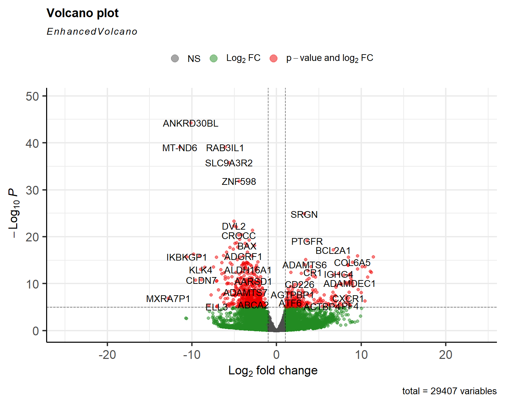
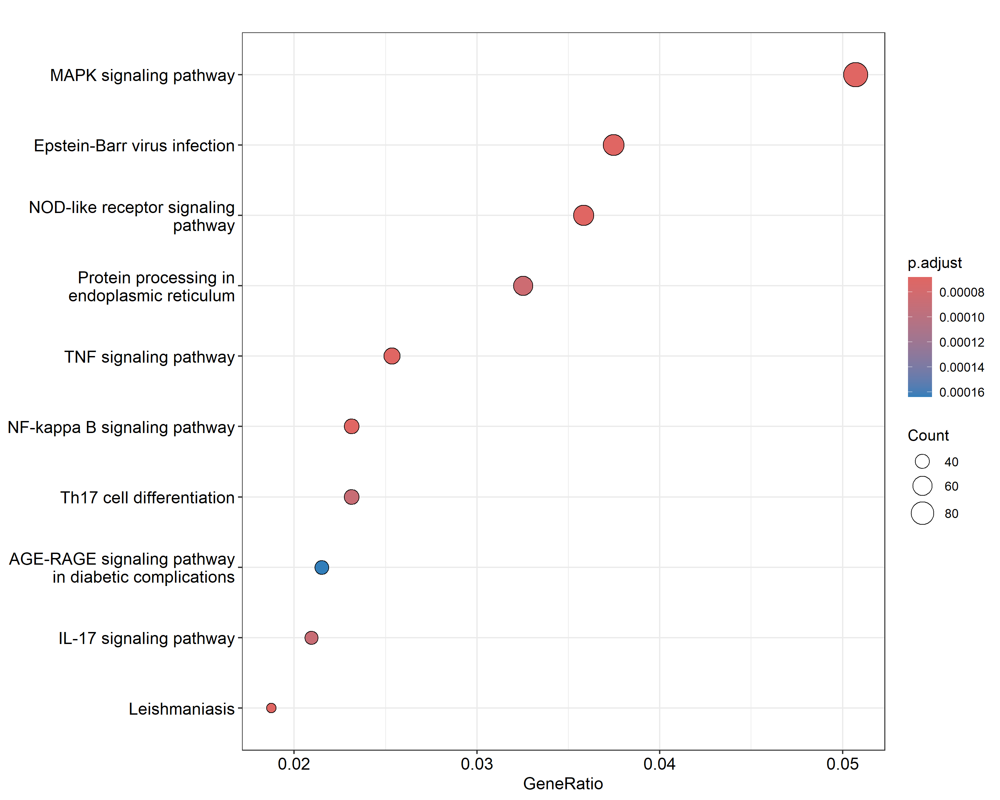
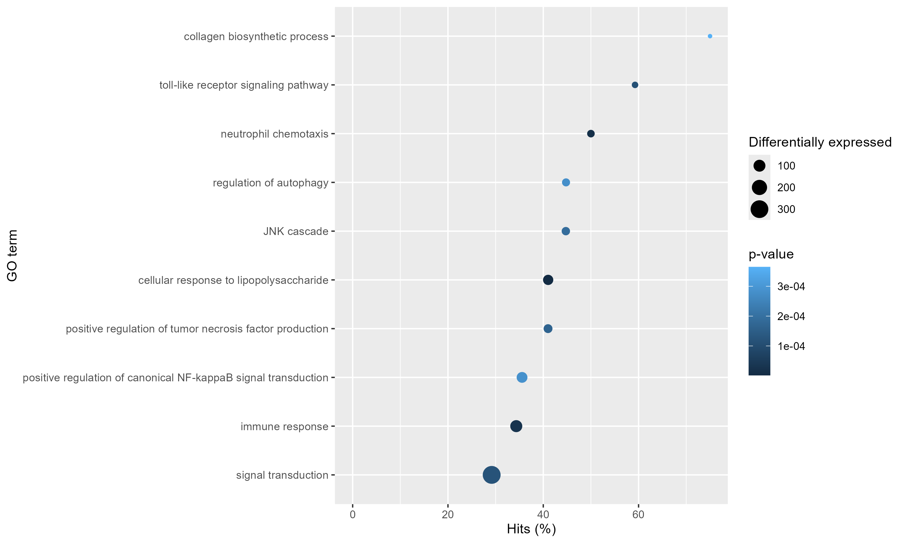

# RA_Transcriptomics_Casus_JB
Transcriptomics analyse van RA patiënten met R en DESeq2

## Inleiding
Reumatroïde Artritis (RA) is een auto-immuunziekte die zich uit in persistente synoviale ontstekingen, leidend tot progressieve gewrichtsschade en verlies van functie (Smolen et al., 2016). De oorzaak omvat genetische aanleg, immuundysregulatie en andere omgevingsfactoren, zoals roken. In de eerste fase, die maanden tot jaren kan duren, wordt gekenmerkt door de aanwezigheid van autoantistoffen en inflammatoire citokines, evenals een veranderende stofwisseling (Firestein & McInnes, 2017). De behandeling van RA is de afgelopen jaren sterk verbeterd door gerichte immuuntherapiën, zoals cytokine-remmers, die ontstekingsroutes in het synovium onderdrukken (McInnes & Schett, 2017). Cytokines zoals TNFs en interleukine-6 (IL-6) spelen een rol in het stimuleren van ontstekingsroutes en de expressie van effector moleculen, die bijdragen aan ontsteking en weefselschade. Interleukines zijn een groep signaalmoleculen die communicatie tussen immuuncellen reguleren. Zij kunnen ontstekingsreacties zowel versterken als verzwakken, afhankelijk van het celtype en de context. Bij RA zijn vooral IL-1ß, IL-6 en IL-17 verhoogd aanwezig in het synovium, waar deze ontstekingen en botafbraak bevorderen. IL-17 bijvoorbeeld bevordert de secretie van RANKL, wat essentieel is voor boterosie in gewrichten (Akhil et al., 2024).
Het gebruik van transcriptomics stelt onderzoekers in staat om genexpressiepatronen te identificeren die veranderen door behandeling of ziekteprocessen. Door het vergelijken van tot expressie gebrachte genen, kunnen mechanismen en signaalroutes worden vastgelegd die betrokken zijn bij de pathogenese van RA (Huang et al., 2023). In dit onderzoek wordt onderzocht: welke genen komen anders tot expressie in het synovium van RA-patiënten en welke metabole of signaalroutes werken hierbij anders dan gezonde controles?

## Materiaal en methode
Voor dit onderzoek werden synoviumbiopten verzameld van 8 personen: 4 personen negatief op ACPA (anti-citrullinated protein antibodies) en 4 positief op ACPA (diagnose > 12 maanden). Ruwe RNA-sequencing data werden geanalyseerd met behulp van R-pakketten, zoals: Rsubread en DESeq2. Reads werden uitgelijnd op het menselijke referentiegenoom (GRCh38) met buildindex en align. Na sorteren en indexeren werd een count matrix gegenereerd met featureCounts. Differentiële genexpressie tussen RA- en controlegroepen werd bepaald met DESeq2. Genen met een p-waarde < 0.05 en een log2FoldChange > 1 of < -1 werden als significant beschouwd. KEGG en GO-analyses werden uitgevoerd met de pakketten clusterProfiler en goseq. De scripts staan in [./Scripts/](./Scripts/) en de ruwe en verwerkte data zijn te vinden in [./Data/](./Data/)

## Resultaten
De differentiële expressieanalyse (Volcano_RA_Analysis) toonde een breed spectrum aan genen met significante veranderingen tussen de RA- en controlegroepen. In de Volcanoplot werd duidelijk dat de meeste genen relatief kleine veranderingen in expressie vertoonden, met foldchange-waarden voornamelijk rond 0. Enkele genen vielen echter op door hun sterke afwijkingen, waaronder ANKRD30BL en MT_ND6 (sterk verlaagd in RA) en SRGN (sterk verhoogd in RA).

De KEGG Pathway analyse (KEGG_dotplot) toonde significante verrijkingen in pathways die relevant zijn voor ontstekingen en immuunrespons. De MAPK-signaleringsroute had de hoogste gene ratio, gevolgd door pathways zoals de Epstein-Barr virus infectie, NOD-like receptor signalering, TNF-signaleringsroute, NF-kB signalering en IL-17 signalering. Dit wijst op een activatie van ontstekingsroutes en immuuncascade die bekend zijn bij RA-pathagonese.

De Gene Ontology Analyse (GO_Plot) richtte zich op biologische processen en vond overrepresentatie in processen zoals neutrofiele chemotaxis, regulatie van autophagie, toll like receptor signalering en positieve regulatie van tumor necrose factor productie. Hoewel 40% van de genen verloren ging tijdens het correctieproces voor genlengte, gaven de resultaten een duidelijk beeld van immuun- en ontstekingsgerelateerde pathways die veranderden bij RA.

## Conclusie
De transcriptomics-analyse van de synoviumbiopten van personen met RA en controle groepen toonden significante verschillen in gen-expressie. Verdere analyse middels KEGG-pathway en Gene Ontology-analyse, bracht belangrijke ontstekings- en immuunroutes aan het licht die bij de pathogenese van RA betrokken zijn, zoals de MAPK-, TNF-, NF-kB en IL-17 signaleringsroutes. De geïdentificeerde genen en geassocieerde pathways bevestigen dat ontstekings- en immuunroutes een centrale rol spelen bij RA.
Daarnaast is aandacht besteed aan het beheer van onderzoeksgegevens en analyse-scripts, wat belangrijk is voor de reproduceerbaarheid en transparantie van bioinformaticaonderzoek. De transcriptomics-analyse heeft aangetoond dat er significante verschillen zijn tussen synoviumbiopten van personen met en zonder RA. De geïdentificeerde genen en geassocieerde pathways bevestigen dat ontstekings- en immuunroutes een centrale rol spelen bij RA.
